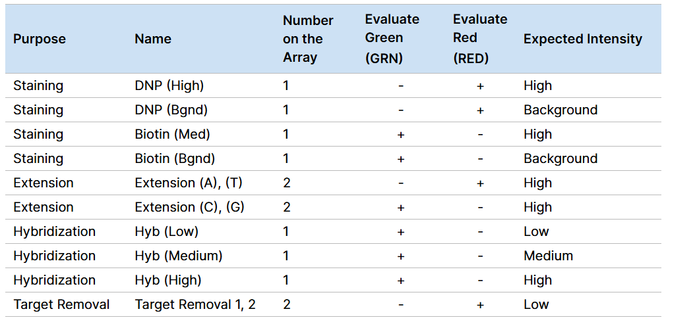
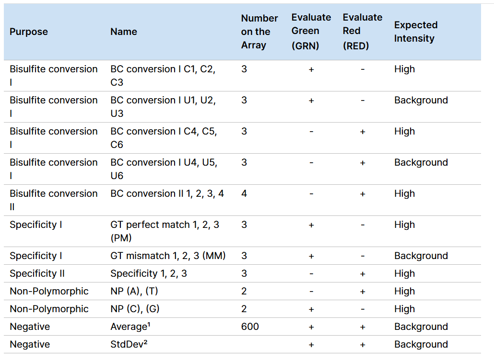
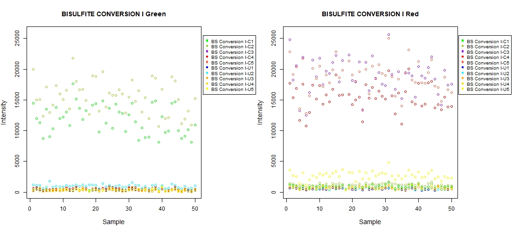
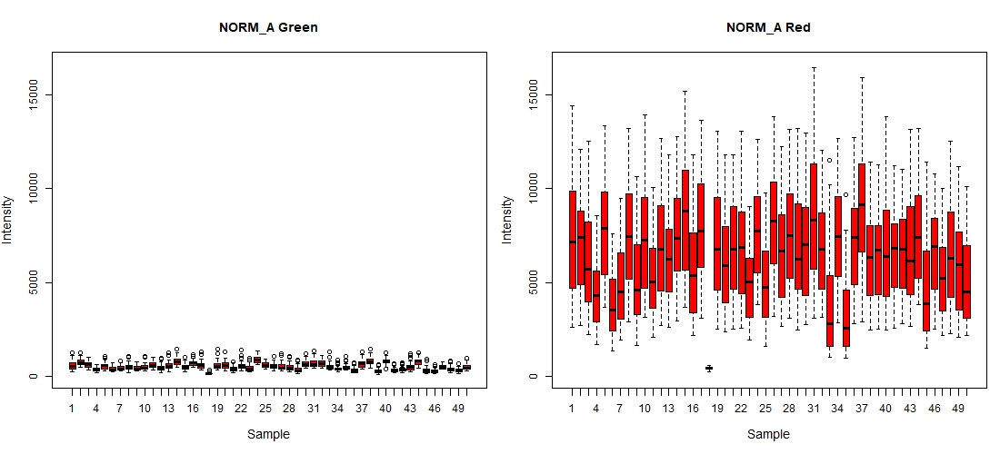
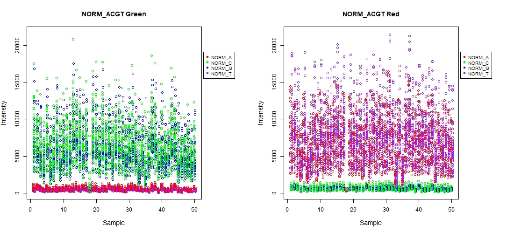
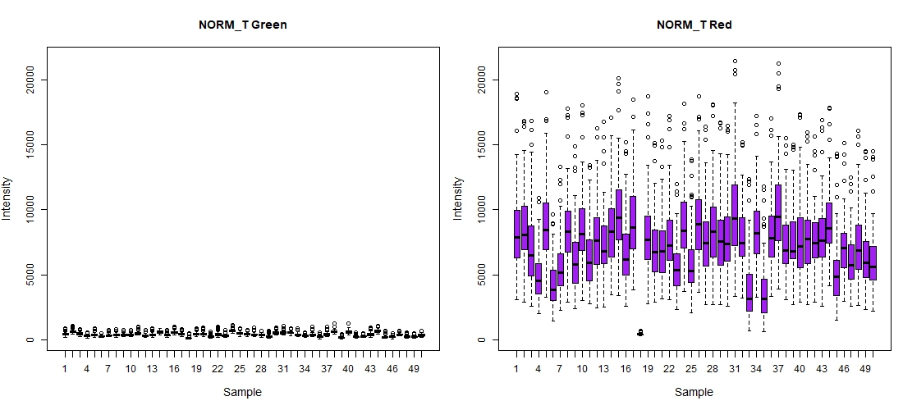
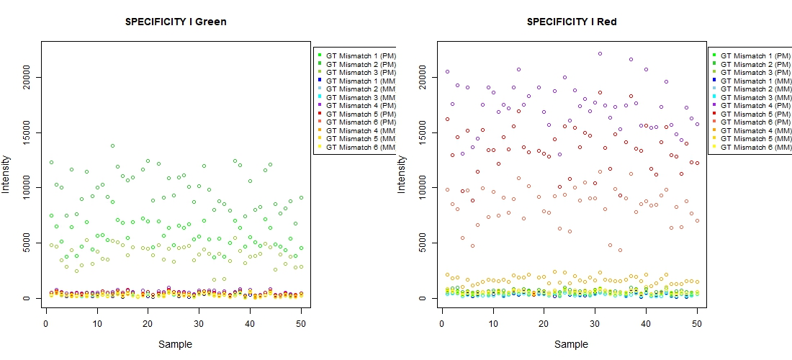

```{r klippy, echo=FALSE, include=TRUE}
klippy::klippy()

```

## Overview
This workshop provides an introduction to DNA methylation analysis using the [`minfi`](https://www.bioconductor.org/packages/devel/bioc/manuals/minfi/man/minfi.pdf) package in R. It covers the following key steps:

1. **Data Import**: Loading raw methylation data from IDAT files.
2. **Exploration**: Generating control plots to assess data quality.
3. **Quality Control**: Assessing the quality of the data using control plots and metrics.
4. **Normalization**: Applying functional normalization to adjust for technical biases.
5. **Filtering**: removing chromosome X and Y probes, and probes with low detection p-values, cross-reactive probes and SNP probes.

### Dataset

The following analysis is based on **DNA methylation** data obtained from the [GEO Series GSE246337](https://www.ncbi.nlm.nih.gov/geo/query/acc.cgi?acc=GSE246337). The dataset includes genome-wide methylation profiles generated using the **Illumina Infinium MethylationEPIC v2.0 array**, derived from blood samples.

A total of **50 samples** were selected for this analysis. Sample-level metadata was extracted and cleaned from the provided *Series Matrix* text file.

*Dataset Summary*

- **Organism:** *Homo sapiens*  
- **Sample size:** 500 individuals  
- **Access:** [NCBI GEO - GSE246337](https://www.ncbi.nlm.nih.gov/geo/query/acc.cgi?acc=GSE246337)  
- **Article:** [bioRxiv (2024)](https://www.biorxiv.org/content/10.1101/2024.05.30.596713v1.full) 

### Aim

The aim of this analysis is to identify differentially methylated CpG sites associated with **Age**, while adjusting for biological covariates including **Sex, Race, and estimated cell-type proportions**. This is achieved using a linear model framework from the package [`limma`](https://bioconductor.org/packages/release/bioc/manuals/limma/man/limma.pdf).

## Libraries

The following code installs and loads the required packages for this analysis.

```{r setup, include=F}
knitr::opts_chunk$set(echo = TRUE)
knitr::opts_chunk$set(warning = F)
knitr::opts_chunk$set(message = F)
knitr::opts_chunk$set(cache = F)
knitr::opts_chunk$set(verbose = F)

```

```{r, include=T}
# Install and load required packages

instalload <- function(cran=NULL, bioc=NULL) {
  pkgs_cran <- cran[!(cran %in% installed.packages()[, "Package"])]
  if (length(pkgs_cran) > 0) {
    install.packages(pkgs_cran, dependencies = T)
  }

  if (!requireNamespace("BiocManager", quietly = T))
          install.packages("BiocManager")
  pkgs_bioc <- bioc[!(bioc %in% installed.packages()[, "Package"])]
  if (length(pkgs_bioc) > 0) {
    BiocManager::install(pkgs_bioc, ask = F)
  }

  pkgs <- c(cran, bioc)
  invisible(lapply(pkgs, require, character.only = T))

  cat("Packages are installed and loaded successfully.\n")
}

# CRAN & Bioconductor packages
cran <- c("ENmix", "ggplot2", "gridExtra", "RColorBrewer",
          "stringr", "Gviz", "rstudioapi", "knitr", "qqman")

bioc <- c("minfi",
          "IlluminaHumanMethylationEPICv2anno.20a1.hg38",
          "IlluminaHumanMethylationEPICv2manifest",
          "FlowSorted.Blood.EPIC", "limma")

instalload(cran, bioc)

```

## Working Directory

The following code sets the working directory to the location of this R Markdown file. 

```{r}
setwd(dirname(getSourceEditorContext()$path))
print(getwd())

```

# Load Data

### Load sample data  

```{r}
# Sample data
targets <- read.csv("data/pheno.csv")
str(targets)

```

The dataset contains **50 samples**. From the above, we can see it includes phenotypic and technical information relevant to DNA methylation analysis. 

In our analysis, we focus on **Age** as the outcome and for now we can consider as covariates **Sex** and **Race**. Variables as **GID**, **Description**, and **Tissue** are used for tracking and data merging, but are not directly included in the statistical model. **SID** and **Basename** are identifiers for each sample, ensuring we can link the metadata to the raw data files. **Tissue** is constant across samples, so it does not need to be included in the model.

### Load methylation data

```{r}
# Load the raw methylation data from the idat files
RGSet <- read.metharray.exp(base="data/idats",
                            targets=targets,
                            extended=F,
                            recursive=F,
                            verbose=F)

str(RGSet)

```
As for now, the data is in the form of an RGChannelSet (unprocessed data), which contains the original red and green intensity values measured by the array. From the above, we can see that the `RGSet` object contains:

- **50 samples** (columns) with associated phenotypic information (sex, age, race, others)
- **Over 1.1 million probes** (rows) representing individual CpG sites

This object will be used as input for exploration, quality control and preprocessing steps.

## Exploration

This section is based on the **Control table** used by [Illumina](https://support-docs.illumina.com/ARR/Inf-MSA/Content/ARR/MSA/ControlBeadTypeTable.htm) to explore expected performance of the assay (Figure 1, 2).

We will generate control plots to assess the quality of the data and identify any potential issues with the samples using the [`ENmix`](https://www.bioconductor.org/packages/devel/bioc/manuals/ENmix/man/ENmix.pdf) package. The issues can be related to the sample preparation, bisulfite conversion, hybridization, or other steps in the methylation assay process.

{width=100%} 

{width=100%}

### Control probes plot using ENmix

```{r}
# Generate ENmix control plots
plotCtrl(RGSet)

# Create a directory for ENmix control plots
if (!dir.exists("figures/enMix")) {
  dir.create("figures/enMix", recursive = TRUE)
}

# Move all .jpg control plots to the target folder
jpgFiles <- list.files(pattern = "\\.jpg$")
file.rename(from = jpgFiles,
            to   = file.path("figures/enMix", jpgFiles))

```

{width=100%}
{width=100%}
{width=100%}
{width=100%}
{width=100%}
{width=100%}
{width=100%}
{width=100%}

From the inspection of all the controls, one sample (around sample 20) shows noticeably low red signal in the **BISULFITE CONVERSION II**, **NORM_A**, **NORM_ACGT**, **NORM_T**, **SPECIFICITY I**, **SPECIFICITY II** and **STAINING**. This sample may require further inspection or exclusion.

# Minfi

When working with DNA methylation data in **minfi**, the data goes through several transformation steps, and each step is stored in a specific type of object (Figure 3). It is important to understand how these object types are connected.

The process begins by reading **IDAT files**, which are stored in an object called an **RGChannelSet**. This raw data is then processed using a **preprocessing function**, which converts it into a **MethylSet**.

From there, two additional functions — **`ratioConvert()`** and **`mapToGenome()`** are used to transform the MethylSet into a **GenomicRatioSet**, which is ready for downstream analysis. 

{width=100%}

```{r}
# Get an overview of the data and annotation
getManifest(RGSet)
head(getAnnotation(RGSet)[, c("Name", "chr", "pos", "UCSC_RefGene_Name")][1:5, ])

```

From the overview of the data, we can see that the Illumina EPIC v2 array includes over 900,000 probes designed to assess DNA methylation across the genome. These probes are divided into two types based on their chemistry: Type I and Type II. Each type has different probe designs, and both are used to maximize coverage and sensitivity.

In addition to methylation probes, the array also includes control probes for quality checks and SNP probes to assess sample identity and potential genetic variation.

Each probe is annotated with genomic coordinates (chromosome, position, others) and often linked to nearby genes. This information helps us understand the biological relevance of methylation changes detected during analysis.

Structure of the IlluminaMethylationManifest Object:
 
- `Number of type I probes`: `128,271` probes that use two separate color channels (`Red` and `Green`) for methylated and unmethylated signals.  
- `Number of type II probes`: `808,719` probes that use a single color channel (`Green`) for both methylated and unmethylated signals.  
- `Number of control probes`: `635` probes included for quality control and normalization.  
- `Number of SNP type I probes`: `24` probes designed to detect single nucleotide polymorphisms (SNPs) using the type I probe structure.  
- `Number of SNP type II probes`: `41` probes designed to detect SNPs using the type II probe structure.  

### Note on the data structure

At this stage, our data is stored in an **RGChannelSet**, which contains the raw intensity signals from the red and green channels on the array.

To start analyzing DNA methylation, we need to convert this into a **MethylSet**, which holds the actual **methylated (Meth)** and **unmethylated (Unmeth)** signal values.

The simplest way to do this is with the **`preprocessRaw()`** function. This function uses the array design to correctly match the probes and color channels, allowing it to generate the Meth and Unmeth signals.

Keep in mind that `preprocessRaw()` does **not** apply any normalization. It's meant to be used for initial **quality control**.

You will see that the original red and green signal assays are now replaced with Meth and Unmeth signals, preparing the data for the next steps in analysis.

```{r}
# Preprocess the raw data to create a MethylSet object
MSet <- preprocessRaw(RGSet)

MSet

```

```{r}
# Check the structure of the MSet object
meth <- getMeth(MSet)
unmeth <- getUnmeth(MSet)

head(meth[1:5, 1:2])
head(unmeth[1:5, 1:2])

```

Here we can se a matrix where rows correspond to `CpG sites`, columns represent `samples`, and values contain `fluorescence intensities` (indicate how much DNA at each CpG site is methylated or unmethylated) from Illumina methylation arrays. These matrices are used to compute Beta values (methylation proportions) and M-values (log-transformed methylation ratios).

```{r}
# Visualize the distribution of methylated and unmethylated intensities
# Log-transform intensities, only for visualization purposes
logMeth <- log10(meth + 1)
logUnmeth <- log10(unmeth + 1)

# Plot density and Increase y axis limit
plot(density(as.vector(logMeth)), col = "darkgreen", lwd = 2,
     main = "Methylated and Unmethylated Intensities",
     xlab = "Log10(Intensity)", ylim = c(0, 1.5))
lines(density(as.vector(logUnmeth)), col = "red", lwd = 2)
legend("topright", legend = c("Methylated", "Unmethylated"),
       col = c("darkgreen", "red"), lwd = 2)

```

Once we have the **methylated (Meth)** and **unmethylated (Unmeth)** signals in a **MethylSet**, we often convert them into values that are easier to work with in analysis **Beta values** and **M-values**. These are stored in a new type of object called a **RatioSet**.

Finally, we want to include **genomic information** such as the chromosome and location of each probe using **`mapToGenome()`** function. This step turns our RatioSet into a **GenomicRatioSet**, which is the format we will use for the downstream analyses.

```{r}
# Convert MethylSet to a GenomicRatioSet object
RatioSet <- ratioConvert(MSet,
                         what = "both",
                         keepCN = TRUE)
# Observe the change of the assays
RatioSet

# Map the RatioSet to the genome
GSet <- mapToGenome(RatioSet)
GSet

```

```{r}
# Obtain metrics to measure methylation levels
beta <- getBeta(GSet)
head(beta[, 1:2])
m <- getM(GSet)
head(m[, 1:2])
cn <- getCN(GSet)
head(cn[, 1:2])

```

The key aspects of obtaing the `beta`, `m` and `cn` are as follows:

*Beta*: 

- Proportion of DNA methylation
- Range: 0 (unmethylated) to 1 (fully methylated)
- Computed as M/(M+U+alpha)

*M*:

- Log-transformed methylation ratio
- Range: -∞ to ∞
- Computed as log2(M/U)
        
*CN-value*:

- Copy number values
- sum of the methylation and unmethylation channel.
        
{width=100%}
# Quality Control

The **`minfi`** package includes a simple and helpful **quality control (QC) plot**. This plot shows the **median intensity** of each sample in the **methylated (M)** and **unmethylated (U)** channels, using a log scale.

When you make this plot, you will usually see that **high-quality samples group together** in one area, while **low-quality (failed) samples** stand out with lower intensities and are more spread out, below or above the line.

```{r}
# Extract and plot the quality control information from the MethylSet
qc <- getQC(MSet)
plotQC(qc,badSampleCutoff = 10.5) + # Default cutoff
title("Quality Control")

```

It seems that we do not have any failed samples, as all samples are above the default cutoff of **10.5**. However, we can still check the detection p-values to ensure that all samples have sufficient quality.

```{r}
# Calculate the detection p-values
detP <- detectionP(RGSet, type = "m+u")

# Examine mean detection p-values across all samples to identify any failed samples
barplot(colMeans(detP),
        las=2,
        cex.names=0.2,
        ylab="Mean detection p-values")
abline(h=0.05,col="red")

```

When deciding if a sample is of **good or bad quality**, it's best **not to rely on just one metric**. Instead, we can also examine the **detection p-values**, which give us insight into how **reliable** the signal is for each CpG site in each sample.

The **`minfi`** package calculates detection p-values by comparing the total signal (methylated + unmethylated) for a probe to the **background noise**, which is estimated using negative control probes.

By plotting the **average detection p-value for each sample**, we can quickly see which samples have **many failed probes** these samples will show **higher mean p-values**, suggesting lower overall quality.

```{r}
# Calculate the mean detection p-values across all samples
meanDetP <- colMeans(detP)

# Identify samples with mean detection p-value > 0.05
failedSamples <- names(meanDetP[meanDetP > 0.05])
failedSamples
RGSetF <- RGSet[, !(colnames(RGSet) %in% failedSamples)]

```

For this particular dataset, **GSM7866981_207700470022_R01C01** is the only sample with a mean detection p-value greater than **0.05**, indicating that it has failed in one or more probes. We can remove this sample from the analysis.

Another helpful way to check the quality of your samples is by looking at the distribution of Beta values. Beta values range from 0 (unmethylated) to 1 (fully methylated), so for a good-quality sample, you would usually expect the values to cluster near 0 and 1.

```{r}
# Inspect the overall density distribution of Beta values
phenoData <- pData(RGSetF)
densityPlot(RGSetF,
            sampGroups = phenoData$Sex,
            pal = brewer.pal(8, "Dark2"),
            main = "Density Plot of Beta Values",
            add = TRUE,
            legend = TRUE,)

```

After removing the failed sample, we can visualize the distribution is as expected. 

# Normalisation

In DNA methylation data analysis, **normalization is a crucial preprocessing step** that addresses technical variation and probe design bias. The Illumina array includes two probe types (Type I and II) with different dynamic ranges, and if not corrected, this can cause **Type I probes to dominate analysis results** due to their broader range. This makes **within-array normalization** essential when comparing or ranking probes. Additionally, **batch effects** systematic differences introduced by factors as reagent concentration or lab conditions can obscure true biological signals. It is recommended to use: 

- **`preprocessFunnorm`** when your samples come from **biologically distinct groups** or it is expected **large anticipated differences** between samples [(Fortin, JP. et al. 2014)](https://genomebiology.biomedcentral.com/articles/10.1186/s13059-014-0503-2).
* Use **`preprocessQuantile`** when samples are from the **same tissue type** or expected to have **similar global methylation profiles**[(Touleimat, N. & Tost, J. 2012)](https://www.tandfonline.com/doi/citedby/10.2217/epi.12.21).

These options generally perform better than older methods as `preprocessRaw`, `preprocessIllumina`, or `preprocessSWAN`, which are still available for convenience.

As we are expecting large anticipated differences between samples, we will apply the preprocessFunnorm method to our data.

```{r}
# Preprocess the data using functional normalization
set.seed(123)
MSetF <- preprocessFunnorm(RGSetF)
MSetF

```

```{r}
# Visualise what the data looks as before and after normalisation
# based on Sex
pal <- brewer.pal(8,"Dark2")

par(mfrow=c(1,2))
densityPlot(RGSetF,
            sampGroups=phenoData$Sex,
            main="Raw",
            legend=FALSE)
legend("top",
       legend = levels(factor(phenoData$Sex)),
       text.col=pal)

densityPlot(getBeta(MSetF),
            sampGroups=phenoData$Sex,
            main="Normalized",
            legend=FALSE)
legend("top",
       legend = levels(factor(phenoData$Sex)),
       text.col=pal)

```

Statistically, normalization should ideally minimize technical noise without compromising biological signals. The right panel indicates a successful normalization, aligning distributions more closely while maintaining inherent biological distinctions.

# Filtering

To improve the reliability of methylation analysis, it is important to remove probes that do not perform well. These poor-quality probes can introduce noise and hide meaningful biological patterns. We will be filtering out probes that fail in one or more samples typically based on high detection p-values, probes located on the X and Y chromosomes, probes with single nucleotide polymorphisms (SNPs) at the CpG site, and cross-reactive probes. This will improve data quality and reduces the burden of correcting for multiple comparisons in statistical analyses.

### Remove probes with low detection p-values

```{r}
# Ensure probes are in the same order in the mSetSq and detP objects
detPF <- detectionP(RGSetF)
detPF <- detPF[match(featureNames(MSetF),
                   rownames(detPF)),]

# Remove any probes that have failed in one or more samples; this next line
# checks for each row of detP whether the number of values < 0.05 is equal
# to the number of samples (TRUE) or not (FALSE)
keep <- rowSums(detPF < 0.05) == ncol(MSetF)
table(keep)

# Subset the GenomicRatioSet
MSetF_Flt <- MSetF[keep,]
MSetF_Flt

```

Removing the sex chromosomes is a common practice in methylation analysis because
these chromosomes often contain common SNPs at the CpG site [(Maksimovic J. et al. 2016](https://pmc.ncbi.nlm.nih.gov/articles/PMC4916993) & [Wang Y. et al. 2021)](https://pmc.ncbi.nlm.nih.gov/articles/PMC8240370). 

### Remove probes from the X and Y chromosomes

```{r}
# Remove probes on the sex chromosomes
keep_chr <- !(featureNames(MSetF_Flt) %in%
                   getAnnotation(RGSet)$Name[getAnnotation(RGSet)$chr
                                             %in% c("chrX", "chrY")])

MSetF_Flt_Rxy <- MSetF_Flt[keep_chr,]

MSetF_Flt_Rxy

#Verify chromosome X and Y were removed
table(getAnnotation(MSetF_Flt_Rxy)$chr)

```

### Remove probes with SNPs at CpG site

```{r}
# Remove probes where common SNPs may affect the CpG methylation signal
MSetF_Flt_Rxy_Ds <- dropLociWithSnps(MSetF_Flt_Rxy, snps = c("SBE", "CpG"), maf = 0.5)
MSetF_Flt_Rxy_Ds

```

### Remove cross-reactive probes

Probes that have been shown to be cross-reactive, meaning those that map to multiple locations in the genome, will also be filtered out. This list was published by [Peters et al. (2024)](https://static-content.springer.com/esm/art%3A10.1186%2Fs12864-024-10027-5/MediaObjects/12864_2024_10027_MOESM8_ESM.csv) and can be accessed through the authors’ publication. 

```{r}
# Exclude cross reactive probes
xReactiveProbes <- read.csv("data/12864_2024_10027_MOESM8_ESM.csv",
                            stringsAsFactors=FALSE)
head(xReactiveProbes)
keep__ <- !(featureNames(MSetF_Flt_Rxy_Ds) %in% xReactiveProbes$ProbeID)

table(keep__)

# Remove cross-reactive probes
MSetF_Flt_Rxy_Ds_Rc <- MSetF_Flt_Rxy_Ds[keep__,]
MSetF_Flt_Rxy_Ds_Rc

```

### Metrics

As reported by [Du, P., Zhang, X., Huang, CC. et al. (2010)](https://bmcbioinformatics.biomedcentral.com/articles/10.1186/1471-2105-11-587), we can calculate the **M-values**, **Beta values**, and **CN values** for the final version of the data. 

- M-values: Better statistical properties.
- Beta values: More easy to interpret.
- CN values: Copy number values.

```{r}
# Calculate M and B values for statistical analysis of the final version of the data
m <- getM(MSetF_Flt_Rxy_Ds_Rc)

beta <- getBeta(MSetF_Flt_Rxy_Ds_Rc)

# Create directory for metrics
if (!dir.exists("rData/metrics")) {
  dir.create("rData/metrics", recursive = TRUE)
}

```

```{r}
# Visualise the distribution of beta and M-values
par(mfrow=c(1,2))
densityPlot(beta, sampGroups=phenoData$Race, main="Beta values",
            legend=FALSE, xlab="Beta values")
legend("top", legend = levels(factor(phenoData$Race)),
       text.col=brewer.pal(8,"Dark2"))
densityPlot(m, sampGroups=phenoData$Race, main="M-values",
            legend=FALSE, xlab="M values")
legend("topleft", legend = levels(factor(phenoData$Race)),
       text.col=brewer.pal(8,"Dark2"))

```

# Cell Type Proportion Estimation

DNA methylation levels measured from whole blood samples are influenced not only by biological and environmental exposures, but also by the **composition of different white blood cell (WBC) types**. Since each immune cell type has its own unique methylation profile, failing to account for variation in cell type proportions can lead to **confounding** in differential methylation analysis especially in epigenome-wide association studies (EWAS) involving **age, sex, or disease states** [(Koestler et al., 2016)](https://bmcbioinformatics.biomedcentral.com/articles/10.1186/s12859-016-0943-7).

To address this, we estimated **cell-type proportions** using reference based deconvolution methods based on the [`FlowSorted.Blood.EPIC`](https://bioconductor.org/packages/devel/data/experiment/manuals/FlowSorted.Blood.EPIC/man/FlowSorted.Blood.EPIC.pdf) reference panel. This panel includes optimized CpGs for identifying immune cell types in Illumina EPIC array data.

```{r}
# Using ENmix to remove the suffix from the beta matrix
betaENMIX<- rm.cgsuffix(beta)

library(FlowSorted.Blood.EPIC)
IDOLOptimizedCpGsBloodv2<- IDOLOptimizedCpGs[which(IDOLOptimizedCpGs%in%rownames(betaENMIX))]
identical(rownames(IDOLOptimizedCpGs.compTable[IDOLOptimizedCpGsBloodv2,]), IDOLOptimizedCpGsBloodv2)

```

```{r}
# Project cell type proportions using the IDOLOptimizedCpGsBloodv2
propEPIC <- projectCellType_CP(
    betaENMIX[IDOLOptimizedCpGsBloodv2, ],
    IDOLOptimizedCpGs.compTable[IDOLOptimizedCpGsBloodv2,],
    contrastWBC = NULL, nonnegative = TRUE,
    lessThanOne = FALSE
)

```

```{r}
# Display the cell type proportions
head(propEPIC)

```

```{r}
# Add the cell type proportions to the phenoData
# Align propEPIC to phenoData
propEPIC_ <- propEPIC[rownames(phenoData), ]

# Combine using cbind()
phenoData <- cbind(phenoData, propEPIC_)

pData(RGSetF) <- phenoData

# Check the updated phenoData
str(phenoData)

```

# Limma

To identify **differentially methylated CpG sites associated with Age**, we applied a **linear modeling approach** using the `limma` package, which was originally developed for gene expression analysis and is widely adopted for high-throughput methylation data. This model adjusts for important **biological covariates** and estimates statistical significance using **empirical Bayes moderation**, improving the detection of true biological signals, especially in modest sample sizes. 

The phenotype metadata (`phenoData`) was converted into a clean `data.frame` (`phenoFV`) for model building.

```{r}
# Convert phenoData in dataframe
phenoFV <- as.data.frame(phenoData)
colnames(phenoFV)
str(phenoFV)

```

Covariates included in the model:

* **Age** (continuous)
* **Sex** (converted to factor)
* **Race**
* **Cell type proportions**: CD4+ T cells, NK cells, B cells, and Monocytes

```{r}
# Convert Sex to factor
phenoFV$Sex <- factor(phenoFV$Sex)
levels(phenoFV$Sex)

```

Before modeling, we inspected the **correlation matrix** of numeric covariates using Spearman’s method to identify potential multicollinearity or confounding.

```{r}
# Check Correlation matrix of numeric variables
numVars <- phenoFV[sapply(phenoFV, is.numeric)]
corMat <- cor(numVars, use = "pairwise.complete.obs", method = "spearman")
corrplot::corrplot(corMat, method = "color", type = "upper", tl.cex = 0.7,
                   tl.col = "black", tl.srt = 45)

```


### Model Specification

A **design matrix** was constructed to model methylation β-values as a function of Age, adjusting for the below covariates. The analysis was performed using `lmFit()` and `eBayes()` from `limma`, which fits a linear model per CpG site:

$$
\text{Methylation}_i \sim \text{Age} + \text{Sex} + \text{Race} + \text{CD4T} + \text{NK} + \text{Bcell} + \text{Mono}
$$
The top differentially methylated positions (DMPs) were extracted using `topTable()` with **Age** as the primary coefficient of interest (`coef = 2`).

```{r}
# Create a design matrix for the linear model
# # [1] "SID"         "Tissue"      "Sex"         "Race"        "Ethnicity"
#  [6] "Age"         "GID"         "Description" "Basename"    "filenames"
# [11] "CD8T"        "CD4T"        "NK"          "Bcell"       "Mono"
# [16] "Neu"         "CD8T.1"      "CD4T.1"      "NK.1"        "Bcell.1"
# [21] "Mono.1"      "Neu.1"
design <- model.matrix(~ Age + Sex + Race + CD4T + NK + Bcell + Mono,
                        data = phenoFV)

fit <- lmFit(beta, design)
fit <- eBayes(fit, trend= TRUE)

tt <- topTable(fit, coef = 2, number = Inf)
tt

```

### Diagnostics

A **Q-Q plot** of the moderated t-statistics for Age was generated to assess whether the distribution of test statistics followed the expected null distribution. Below we can se a deviation from the diagonal line at the tail supporting the presence of true differential methylation signals.

```{r}
# Q-Q plot of moderated t-statistics
qqt(fit$t[,2],
    df=fit$df.residual+fit$df.prior)
abline(0,1)

```

### Genomic Visualization

To map significant CpGs to their genomic coordinates:

* We merged the model output (`tt`) with probe annotation from the normalized object (`MSetF_Flt_Rxy_Ds_Rc`).
* We then created a **Manhattan plot**, which visualizes the genome-wide distribution of association p-values, highlighting regions of strong differential methylation.

Genome-wide and suggestive significance thresholds were annotated:

* **Genome-wide**: p < 5 × 10⁻⁸ (red line)
* **Suggestive**: p < 5 × 10⁻⁵ (blue line)

```{r}
# Get Annotation
tt$IID <- rownames(tt)
ann <- getAnnotation(MSetF_Flt_Rxy_Ds_Rc)
manhattanData <- merge(tt, ann[, c("Name", "chr", "pos")],
                       by.x = "IID", by.y = "Name")
# Create dataframe to plot MH plot
manhattanData <- data.frame(
  SNP = manhattanData$IID,
  CHR = as.numeric(gsub("chr", "", manhattanData$chr)),
  BP = manhattanData$pos,
  P = manhattanData$P.Value
)

manhattan(manhattanData, annotatePval = 5e-08, chrlabs = c(1:22),
          main = "Manhattan Plot", ylim = c(0, 20), cex.axis = 0.4,
          suggestiveline = -log10(5e-05), genomewideline = -log10(5e-08))

```

# References

1. Bates, D., Mächler, M., Bolker, B., & Walker, S. (2015). Fitting Linear Mixed-Effects Models Usinglme4. Journal of Statistical Software, 67(1). https://doi.org/10.18637/jss.v067.i01 
2. Hansen, K. D., & Fortin, J.-P. (2025). The minfi User’s Guide. In https://bioconductor.org/packages/devel/bioc/vignettes/minfi/inst/doc/minfi.html
3. Heiss, J. (2013). Recommended Work Flow. In https://hhhh5.github.io/ewastools/articles/exemplary_ewas.html
Horvath, S. (2013). DNA methylation age of human tissues and cell types. Genome Biol, 14(10), R115. https://doi.org/10.1186/gb-2013-14-10-r115 
4. Maksimovic, J., Phipson, B., & Oshlack, A. (2017). A cross-package Bioconductor workflow for analysing methylation array data. F1000Research, 5. https://f1000research.com/articles/5-1281 
5. Marschner, I. C. (2011). glm2: Fitting Generalized Linear Models with Convergence Problems. R Journal, 3(2), 12-15. https://journal.r-project.org/archive/2011/RJ-2011-012/RJ-2011-012.pdf 
6. Pelegri , D., & Gonzalez, J. R. (2015). Chronological and gestational DNAm age estimation using different methylation-based clocks. In https://bioconductor.org/packages/release/bioc/vignettes/methylclock/inst/doc/methylclock.html
7. Smialowska, A., Vasquez, L., Ringnér, M., Elsässer, S., Navarro Luzón, C., Nordlund, J., Metzger, A., Contreras‐López, O., Westholm, J., Van Hoef, V., Dethlefsen, O., & Ewels, P. (2025). DNA Methylation: Array Workflow. In https://nbis-workshop-epigenomics.readthedocs.io/en/latest/content/tutorials/methylationArray/Array_Tutorial.html#gene-ontology-testing

# Full Methylation Analysis Pipeline

We developed a comprehensive and automated pipeline, publicly available on GitHub:

🔗 [DNAm Pipeline](https://github.com/n10962646/EMERGES_DNAm)

The pipeline is implemented in R, follows best practices from Bioconductor, and is structured to be compatible with batch processing and cluster environments.


